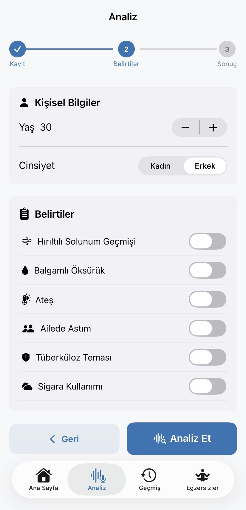
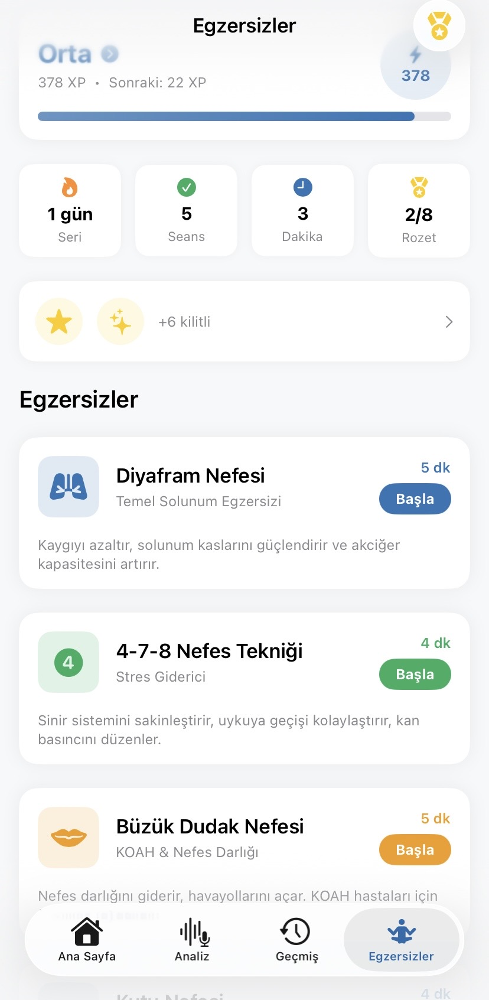

# SolunumAI 🫁

**Yapay Zeka Destekli Solunum Hastalığı Tarama Uygulaması**

Öksürük sesi analizi ile COVID-19 / Gribal Enfeksiyon, Astım ve KOAH risk taraması yapan iOS uygulaması + FastAPI backend.

---

## Mimari

```
SolunumAI/
├── API/                          # FastAPI Python Backend
│   ├── main.py                   # Ana uygulama + ML pipeline
│   ├── requirements.txt
│   ├── Dockerfile
│   └── models/                   # ML model dosyaları
│       ├── model_covid_clean.pkl # COVID/gribal ses modeli
│       ├── model_airs_full.pkl   # Astım/KOAH modeli
│       └── scaler_airs.pkl       # AIRS özellik ölçekleyici
│
├── SolunumAI/                    # iOS SwiftUI Uygulaması
│   ├── App/
│   │   └── SolunumAIApp.swift    # @main + TabView
│   ├── Views/
│   │   ├── HomeView.swift        # Tab 1 — Ana Sayfa
│   │   ├── AnalysisView.swift    # Tab 2 — Analiz sihirbazı
│   │   ├── HistoryView.swift     # Tab 3 — Geçmiş
│   │   ├── ExercisesView.swift   # Tab 4 — Nefes egzersizleri
│   │   ├── ExerciseSessionView.swift
│   │   └── DisclaimerView.swift
│   ├── Components/
│   │   ├── RiskGaugeView.swift
│   │   ├── AudioWaveformView.swift
│   │   ├── BreathingAnimationView.swift
│   │   └── HealthTipCardView.swift
│   ├── Models/
│   │   ├── AnalysisResult.swift
│   │   └── SolunumAI.xcdatamodeld/
│   └── Services/
│       ├── APIService.swift
│       ├── AudioRecorderService.swift
│       ├── CoreDataService.swift
│       └── ExerciseProgressService.swift
│
└── render.yaml                   # Render.com deployment
```

---

## ML Pipeline

```
Ses (WAV / M4A)
    └─► librosa (16kHz, mono, PCM-16)
    └─► YAMNet (1024-dim embedding)
         ├─► model_covid_clean  (1024-dim) → p1  (COVID/gribal olasılığı)
         └─► model_airs_full    (512-dim + 9 klinik özellik) → p2  (Astım/KOAH olasılığı)

p_final = 0.55 × p1 + 0.45 × p2
```

### Kullanılan Modeller

| Dosya | Açıklama |
|-------|----------|
| `model_covid_clean.pkl` | XGBoost — ses'ten COVID/gribal tespiti (1024-dim) |
| `model_airs_full.pkl` | XGBoost — Astım/KOAH tespiti (ses + klinik veri) |
| `scaler_airs.pkl` | StandardScaler — 9 klinik özellik için |

---

## Hızlı Başlangıç

### API'yi Başlatın

```bash
cd API
python -m venv .venv
source .venv/bin/activate
pip install -r requirements.txt
uvicorn main:app --host 0.0.0.0 --port 8000
```

API Dokümantasyonu: [http://localhost:8000/docs](http://localhost:8000/docs)

### iOS Uygulamasını Açın

```bash
open SolunumAI.xcodeproj
```

---

## API Referansı

### `POST /analyze`

**Form Data:**

| Alan | Tip | Açıklama |
|------|-----|----------|
| `audio` | File | WAV / M4A (2-10 sn) |
| `metadata` | string | JSON — aşağıya bakın |

**Metadata JSON:**

```json
{
  "yas": 30,
  "cinsiyet": 1,
  "ates": false,
  "wheeze_gecmis": false,
  "balgam": false,
  "aile_astim": false,
  "tb_temas": false,
  "sigara": false,
  "pack_years": 0
}
```

**Yanıt:**

```json
{
  "p1": 0.81,
  "p2": 0.34,
  "p_final": 0.60,
  "p_final_yuzde": 60.0,
  "airs_pred": 0,
  "airs_isim": "Sağlıklı",
  "genel": "COVID-19 / viral enfeksiyon riski tespit edildi",
  "alt_karar": "COVID-19 / viral solunum yolu enfeksiyonu şüphesi",
  "oneri": "PCR veya antijen testi yaptırın..."
}
```

---

## iOS Uygulama Özellikleri

- **Ana Sayfa** — Akıllı selamlama, günlük özet, hızlı aksiyonlar, son analiz kartı
- **Analiz** — Ses kaydı / yükleme, kırpma, semptom girişi, AI sonuç ekranı
- **Geçmiş** — Tüm analizler, trend grafik, CSV dışa aktarma
- **Egzersizler** — 5 nefes egzersizi, XP/seviye sistemi, günlük seri takibi

## Teknik Gereksinimler

- **iOS 16+** / **Xcode 15+** / **Swift 5.9+**
- **Python 3.11+**

---

## Ekran Görüntüleri

| Ana Sayfa | Analiz - Kayıt | Analiz - Belirtiler |
|:---------:|:--------------:|:-------------------:|
|  |  |  |

| Sonuç - COVID Riski | Sonuç - Düşük Risk | Geçmiş |
|:-------------------:|:------------------:|:------:|
|  |  |  |

| Egzersizler | Açılış Ekranı |
|:-----------:|:-------------:|
|  |  |

---

> ⚠️ Bu uygulama tıbbi tanı koyamaz. Sonuçlar yalnızca bilgilendirme amaçlıdır. Kesin tanı için mutlaka bir sağlık profesyoneline başvurun.
